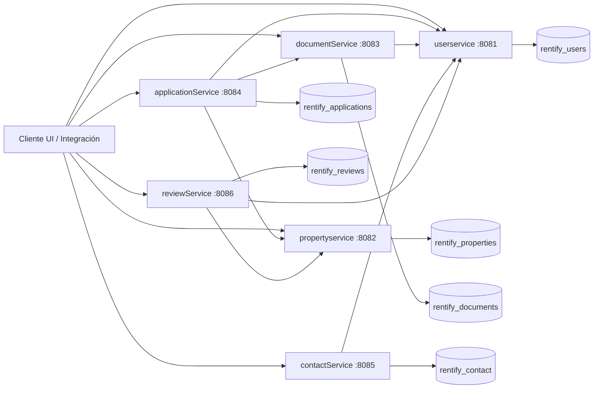
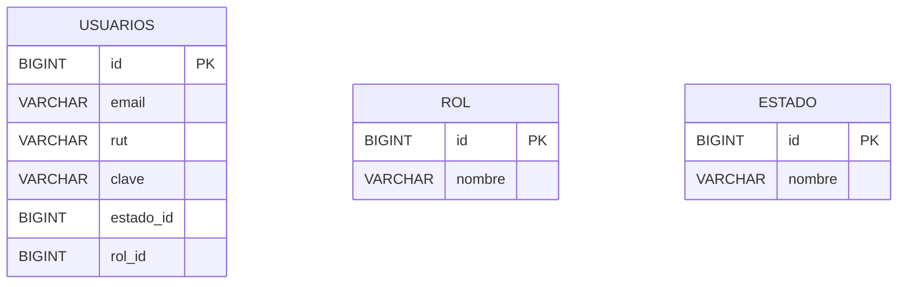
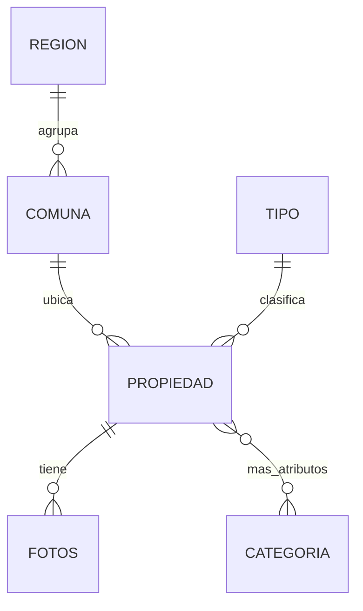

# Rentify

Backend de arriendos basado en microservicios (Spring Boot) que cubre gestión de usuarios/roles, propiedades con fotos y ubicación, solicitudes y registros de arriendo, documentos de usuarios, reseñas y mensajes de contacto.

## Microservicios

| Servicio | Dominio | Puerto | Base de datos (MySQL) | API base |
|---|---|---:|---|---|
| userservice | Usuarios, roles, estados, login | 8081 | rentify_users | `/api/usuarios` |
| propertyservice | Propiedades, fotos, ubicación, categorías | 8082 | rentify_properties | `/api/propiedades` |
| documentService | Documentos de usuario, tipos, estados | 8083 | rentify_documents | `/api/documentos` |
| applicationService | Solicitudes y registros de arriendo | 8084 | rentify_applications | `/api/solicitudes` |
| contactService | Mensajes de contacto y respuestas | 8085 | rentify_contact | `/api/contacto` |
| reviewService | Reseñas (propiedad/usuario) y promedios | 8086 | rentify_reviews | `/api/reviews` |

## Tecnologías

- Lenguaje: Java 17 (y Kotlin en dependencias/tests de userservice)
- Framework: Spring Boot 3.5.x
- Persistencia: Spring Data JPA + MySQL
- Comunicación entre servicios: HTTP REST con WebClient (Spring WebFlux)
- Documentación de API: springdoc-openapi (Swagger UI)
- Utilidades: ModelMapper, Lombok
- Observabilidad: Actuator (configurado en varios servicios)
- Pruebas: JUnit (starter test), Mockito, AssertJ, H2 (tests), MockWebServer, Reactor Test

## Arquitectura (visión general)



## Modelo de datos (resumen)

Los servicios se integran por IDs (por ejemplo `usuarioId`, `propiedadId`) para evitar acoplamiento de esquemas. Cada microservicio mantiene su propia base de datos.

### userservice

- Entidades principales: `Usuario`, `Rol`, `Estado`
- Notas: login por email/clave; en el repositorio la clave se compara en texto plano (se sugiere BCrypt para producción)



### propertyservice

- Entidades principales: `Property` (propiedad), `Foto`, `Comuna` → `Region`, `Tipo`, `Categoria`
- Relación destacada: propiedad tiene muchas fotos y muchas categorías (tabla intermedia `mas_atributos`)



### applicationService

- Entidades principales: `SolicitudArriendo` (estado PENDIENTE/ACEPTADA/RECHAZADA), `RegistroArriendo` (monto, fechas, activo)
- Integración: referencia `usuarioId` y `propiedadId` como IDs externos

### documentService

- Entidades principales: `Documento` (con `usuarioId`, `estadoId`, `tipoDocId`), `Estado`, `TipoDocumento`
- Función clave: verificación de documentos aprobados por usuario

### reviewService

- Entidades principales: `Review` (puntaje 1–10, comentario, estado ACTIVA/BANEADA/OCULTA), `TipoResena`
- Integración: reseña puede ser por `propiedadId` o por `usuarioResenadoId`

### contactService

- Entidad principal: `MensajeContacto` (estado PENDIENTE/EN_PROCESO/RESUELTO, respuesta y auditoría básica)
- Integración: `usuarioId` opcional (si el mensaje proviene de un usuario identificado)

## Ejecución local (Windows / MySQL)

Requisitos:
- Java 17
- MySQL (8 recomendado)

Los `application.properties` están configurados para MySQL local con:
- usuario: `root`
- contraseña: vacía
- `createDatabaseIfNotExist=true` (crea el schema si no existe)

Ejecutar un microservicio:
- En cada carpeta de servicio (ej. `userservice`), usar el wrapper de Maven:

```powershell
.\mvnw.cmd spring-boot:run
```

Swagger UI por servicio:
- userservice: http://localhost:8081/swagger-ui/index.html
- propertyservice: http://localhost:8082/swagger-ui/index.html
- documentService: http://localhost:8083/swagger-ui/index.html
- applicationService: http://localhost:8084/swagger-ui/index.html
- contactService: http://localhost:8085/swagger-ui/index.html
- reviewService: http://localhost:8086/swagger-ui/index.html

## Flujos funcionales (alto nivel)

- Registro/login de usuarios: `POST /api/usuarios` y `POST /api/usuarios/login` (userservice)
- Gestión de propiedades: CRUD + búsqueda por filtros en `/api/propiedades` (propertyservice)
- Solicitud de arriendo: crear y actualizar estado en `/api/solicitudes` (applicationService)
- Documentos: subir, listar por usuario y aprobar/rechazar con observaciones en `/api/documentos` (documentService)
- Reseñas: crear, listar, promedios y moderación de estado en `/api/reviews` (reviewService)
- Contacto: crear mensaje, responder, estadísticas en `/api/contacto` (contactService)

## Notas

- Este repositorio contiene el backend. Los orígenes CORS apuntan a clientes locales típicos (por ejemplo 5173/3000), pero el frontend no está incluido aquí.
- No hay módulo de pagos/carrito ni seguridad basada en tokens en este código; si el proyecto lo requiere, es una extensión natural (JWT + roles).
